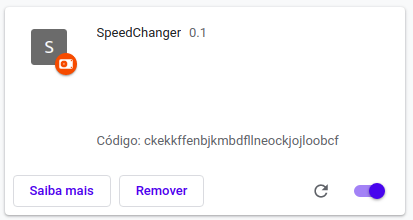

# Speed Changer Chrome Extension

Basically a extension made for the Google Chrome browser that allows you to change the speed of the voice messages and audios.

## How it Works?

### The manifest.json

A JSON (JavaScript Object Notation) that we use to "define" our code as a Google Chrome extension.

### The content.js file

In this file, we code the Speed Changer extension using raw Javascript.

### Our tiny style.css

Some styles in our extension, currently (v0.1) i just styled the button.

## How can i use?

### Installing the extension

You need to set your **Google Chrome's Developer Mode** on! After that, you just drag the files to the *chrome://extensions* page.

### Turning on

Before you listen to an audio using your Whatsapp Web you have to click the button in the superior left corner of your screen, next to your profile picture and other buttons.

*In others versions the button may be ">>>" instead "2x"!*

